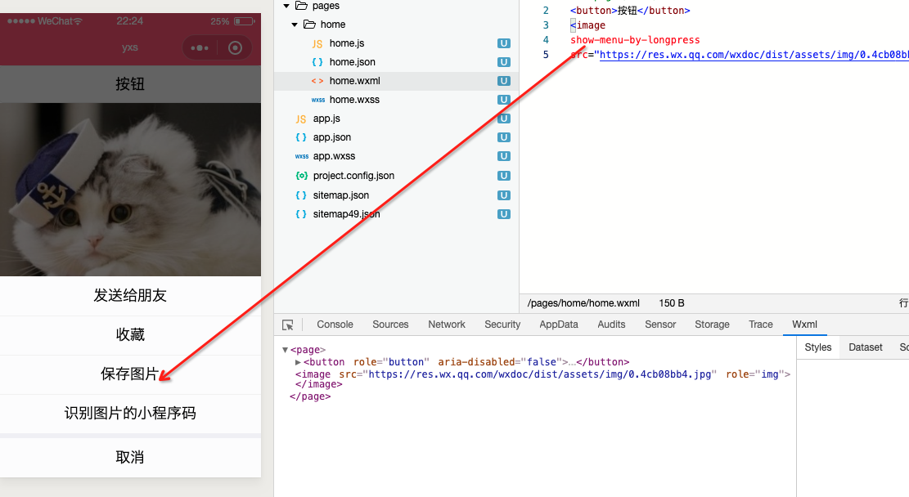

::: tip

1.  **微信小程序的开发**迫在眉睫

:::

## 注册 App 时

### 判断小程序的进入场景

### 监听生命周期函数

```js
App({
  /**
   * 当小程序初始化完成时，会触发 onLaunch（全局只触发一次）
   */
  onLaunch: function() {
    console.log(`小程序初始化完成`);
    // 获取用户的信息
    // wx.getUserInfo({
    //   success:function(res){
    //     // console.log(res)
    //   }
    // })
  },

  /**
   * 当小程序启动，或从后台进入前台显示，会触发 onShow
   */
  onShow: function(options) {
    // 场景值 判断小程序进入的场景
    // 获取用户的信息 并且收到信息时 将用户信息传递给服务器
  },

  /**
   * 当小程序从前台进入后台，会触发 onHide
   */
  onHide: function() {},

  /**
   * 当小程序发生脚本错误，或者 api 调用失败时，会触发 onError 并带上错误信息
   */
  onError: function(msg) {}
});
```

### 定义全局的数据

因为 App()实例只有一个，并且是全局共享的(单例对象)，故可以将一些全局共享的数据放在这里

```js
globalData: {
  name: `yayxs`;
}
```

## 注册 Page 时

首先 Page()依然是传入一个对象

```js
Page({});
```

### 监听页面生命周期函数

```js
Page({
  onLoad() {
    console.log(`onLoad`);
  },
  onReady() {
    console.log(`onReady`);
  },
  onShow() {
    console.log(`onShow`);
  },
  /**
  页面隐藏起来
  */
  onHide() {
    console.log(`onHide`);
  },
  onUnload() {
    console.log(`onUnload`);
  }
});
```

在 `onLoad（）`中交互请求

```js
wx.request()({
  url: ``,
  success: res => {
    console.log(res);
  }
});
```

### 初始化数据

```js
Page({
  data: {}
});
```

### 监听 wxml 文件中的事件

### 监听其他的事件

#### 监听页面的滚动

#### 监听页面滚动到底部

## 内置组件

### text

| 属性       |                   作用                   |           常用值 |
| ---------- | :--------------------------------------: | ---------------: |
| selectable | 默认情况下 text 中的文本长按是不是能选中 |                  |
| space      |            决定文本空格的大小            | nbsp、ensp、emsp |
| decode     |                   解码                   |                  |

### button

`button`按钮默认会占据一行，原因是变成了`block`

```css
button {
  position: relative;
  display: block;
  margin-left: auto;
  margin-right: auto;
  padding-left: 14px;
  padding-right: 14px;
  box-sizing: border-box;
  font-size: 18px;
  text-align: center;
  text-decoration: none;
  line-height: 2.55555556;
  border-radius: 5px;
  -webkit-tap-highlight-color: transparent;
  overflow: hidden;
  color: #000000;
  background-color: #f8f8f8;
}
```

| 属性  |                   作用                   |  常用值 |
| ----- | :--------------------------------------: | ------: |
| size  | 默认情况下 text 中的文本长按是不是能选中 |    mini |
| type  |                   样式                   | primary |
| plain |                   解码                   |         |

### view

### image

- **image** 可以写成单标签，也可是双标签
- 默认有自己的大小
- 是一个行内块元素（inline-block）

#### src

选中相册中图片

```js
<image
  show-menu-by-longpress
  src="https://res.wx.qq.com/wxdoc/dist/assets/img/0.4cb08bb4.jpg"
/>
// 开启长按图片显示识别小程序码菜单
```


